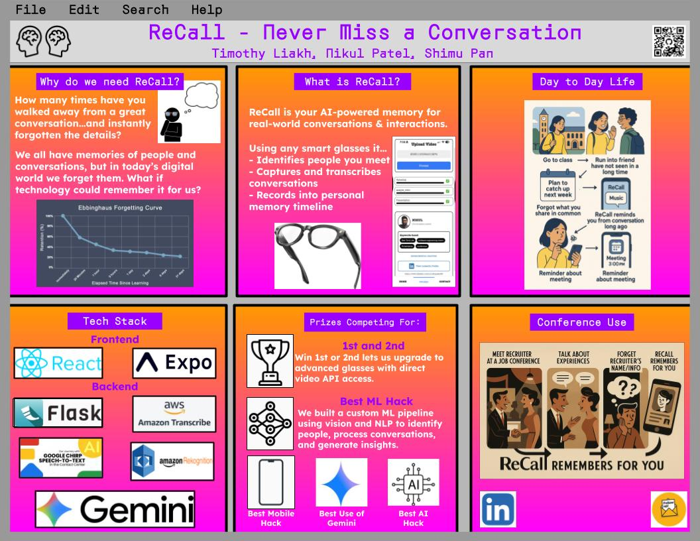

# ReCall

ReCall is a lightweight memory assistant that turns raw conversations into something you can actually browse. We pair an Expo-based mobile app (“Home”, “Memory”, “Highlights”, “Upload”) with a Flask backend that handles video uploads, face recognition, transcript analysis, and highlight detection.



## Quick Tour

- **Home** – a quick at-a-glance of the constellation of people you've talked to, highlights coming up, and shortcuts to upload or browse memories.
- **Memory** – every person, their latest transcript, and a scoped “Ask AI” section that only references their conversations.
- **Highlights** – a short list of reminders (birthdays, next steps, etc.) you can complete or dismiss with a single tap.
- **Upload** – drop in a new video, we do the rest (faces, transcripts, and linking to the right person).

## Running ReCall

```bash
# Backend
cd backend
python -m venv .venv && source .venv/bin/activate   # Windows: .venv\Scripts\activate
pip install -r requirements.txt
cp .env.example .env   # then copy in your AWS/Gemini keys + BASE_URL (see below)
python app.py

# Frontend
cd frontend
npm install
cp config.example.js config.js   # set BASE_URL to your backend
npm run start                    # expo start
```

### Environment keys

Populate `backend/.env` with the same values used in development:

```
AWS_ACCESS_KEY_ID=
AWS_SECRET_ACCESS_KEY=
AWS_REGION=
GEMINI_API_KEY=
BASE_URL=
```

The speech-to-text analyzer also expects `backend/analyzers/google_key.json` to contain the same Google Cloud service account JSON you used while building the project. Drop that JSON file in place before running `app.py`.

Use Expo Go (or a simulator) to open the QR code shown in the terminal.

## Why This Is Ethical

We spent time documenting how we capture and use memories responsibly. You can read that outline here:
[Ethical Use of ReCall](https://docs.google.com/document/d/1syaJEmcLC6CF5mZdOM4GjW2F5q3-6_wzQd5EjInG5Zk/edit?usp=sharing)

In short: recordings must be consensual, we keep memories on your device/back-end only, and every highlight is meant to help with relationship follow‑ups—not surveillance.

## Project Structure

```
backend/      # Flask API, analyzers, services (highlights, LinkedIn enrichment, etc.)
frontend/     # Expo app with Home, Memory, Highlights, Upload screens
docs/images/  # Pitch deck snippets and screenshots
```

## Tech Grab Bag

- **Frontend** – React Native 0.81 (Expo 54), Axios, Safe Area Context.
- **Backend** – Flask, InsightFace, OpenCV, MoviePy, Google Speech + Gemini APIs.
- **Storage** – JSON conversation files (`backend/conversations`), cropped faces (`backend/faces_db`).

## What’s Next

- Ship a secure cloud sync (currently files live on the host you deploy).
- Add inline editing so you can correct transcripts without re-uploading.
- Polish the command center with more “morning digest” style insights.

Have fun with ReCall—and let us know if you drop it into a hackathon booth. 😊
